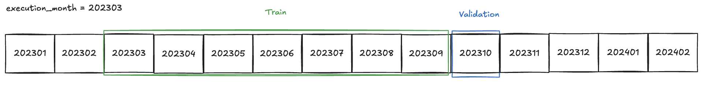
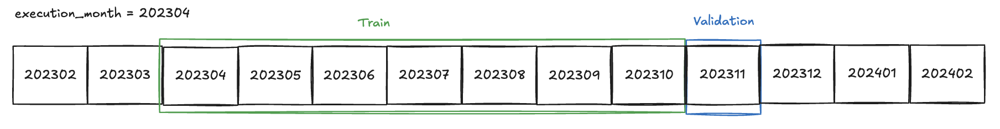
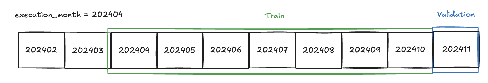

# Churn prediction model of an advertisement portal using anonymized data.

Python version = 3.11.0 
- pyenv to install the python version
- uv to manage virtualenv and dependencies

First steps:
1. Clone the repo
2. `pyenv install 3.11.0` & `pyenv local 3.11.0`. `pyenv versions` output should be 3.11.0 with an asterisk.
3. Start the virtual environment `uv sync` and `source .venv/bin/activate` will create the environment with the dependencies defined at pyproject.toml.
4. We can add new dependencies with `uv add <package>`
5. To use this environment as the kernel in notebooks `python -m ipykernel install --user --name=churn-prediction-zrive`

Data available:
- Add into /data folder: `zrive_advertiser_withdrawals.parquet` , `data/zrive_dim_advertiser.parquet` and `zrive_fct_monthly_snapshot_advertiser.parquet`

Data preparation:

- The notebook to define the target is `v1_dataset.ipynb`. 
- Based on this notebook, src/prepare_data.py combines the 3 datasets into a unique dataset called `processed_data.parquet`. To execute , run `python3 -m src.prepare_data` with the environment activated.

Feature engineering:

- The notebook to define new features is `v3_feature_engineering.ipynb`.
- Based on this notebook, src/feature_engineering.py transforms `processed_data.parquet` into `full_data.parquet`. To execute, run `python3 src/feature_engineering.py`

Training:

- The final notebook is train_boosting.ipynb. This notebook includes a rolling window validation schema. 
Starting on 2023-03, train a model with 7 months, validation with following month.

Repeat this proccess until the last month of data:

